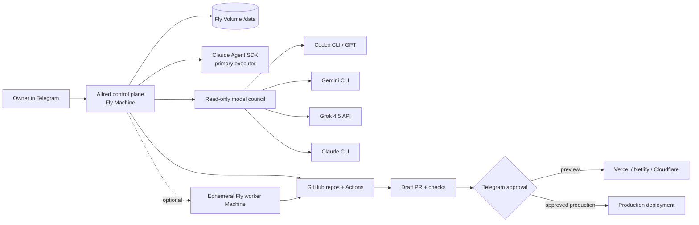

# Alfred on Fly.io — Production Architecture

## Goal

Turn the existing `yishaik/alfred` Telegram ↔ Claude Agent SDK bridge into a private engineering control plane that can inspect repositories, write code, run tests, open draft PRs, create preview deployments, and request approval before production changes.

## Topology

## Trust boundaries

### Control plane

The always-on Fly Machine receives Telegram updates and keeps Alfred state. It has only the credentials needed for control, GitHub access, and approved deployment adapters. It never exposes a general-purpose public API; the HTTP service returns only health status.

### Repository workspace

All repositories live below `/data/workspaces`. Path resolution rejects traversal outside that root. Every task uses a branch and ends in a draft PR. The default branch is not directly modified.

### Model council

Claude, GPT/Codex, Gemini, and Grok may independently review a task. Council calls are read-only. They do not receive deployment permissions, and their output is advisory rather than automatically executed.

### Optional isolated workers

For higher-risk builds, the control plane may create an `auto_destroy` Fly Machine in a separate worker app. That app should receive a repository-scoped GitHub credential but no Vercel, Netlify, Cloudflare, Supabase, or Fly production token. Workers may only create draft PRs.

## Persistence

The Fly Volume stores:

- `/data/state`: Alfred sessions, jobs, memory, audit, costs, backups
- `/data/workspaces`: repository checkouts
- `/data/home`: Claude, Codex, Gemini and platform CLI authentication state

The image remains replaceable. Deploying a new image does not delete state or login credentials.

## Model policy

- Primary executor: Claude Fable 5, falling back to Claude Opus 4.8 when needed.
- GPT council / complex reasoning: GPT-5.6 Sol through Codex or API.
- Coding specialist: GPT-5.3-Codex for isolated implementation workers.
- Google reviewer: Gemini 3.1 Pro Preview; Gemini 3.5 Flash for routing and cheap fast tasks.
- Independent reviewer: Grok 4.5 through xAI API.

Pin exact model IDs in production where reproducibility matters. Use `*-latest` only for explicitly accepted automatic upgrades.

## Deployment adapters

| Platform | Preview behavior | Production gate |
|---|---|---|
| GitHub | branch, tests, draft PR | merge remains human-controlled |
| Vercel | preview deployment | exact `vercel:owner/repo` approval |
| Netlify | draft deploy | exact `netlify:owner/repo` approval |
| Cloudflare | Wrangler dry-run | exact `cloudflare:owner/repo` approval |
| Supabase | linked DB lint | exact `supabase:owner/repo` approval |
| Hugging Face | identity/repo validation | exact `huggingface:owner/repo` approval |
| Tavily | search only | no write capability |
| AppDeploy | handoff manifest | completed in AppDeploy-enabled ChatGPT |

## Availability model

One control-plane Machine stays running because Telegram long polling and scheduled jobs require continuity. Fly health checks verify the wrapper process. Fly restarts the Machine after failure; Alfred's own session queue and persistent state handle application recovery.
